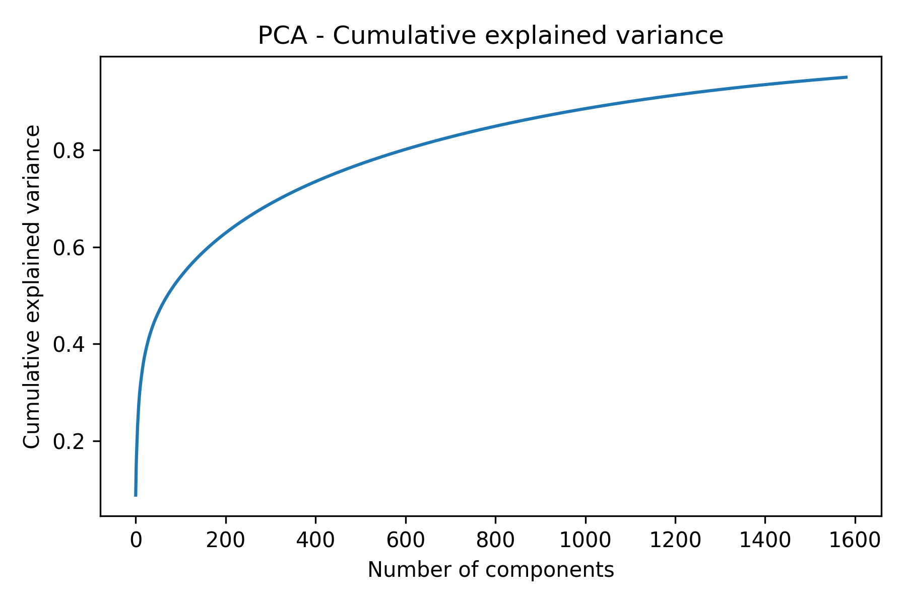
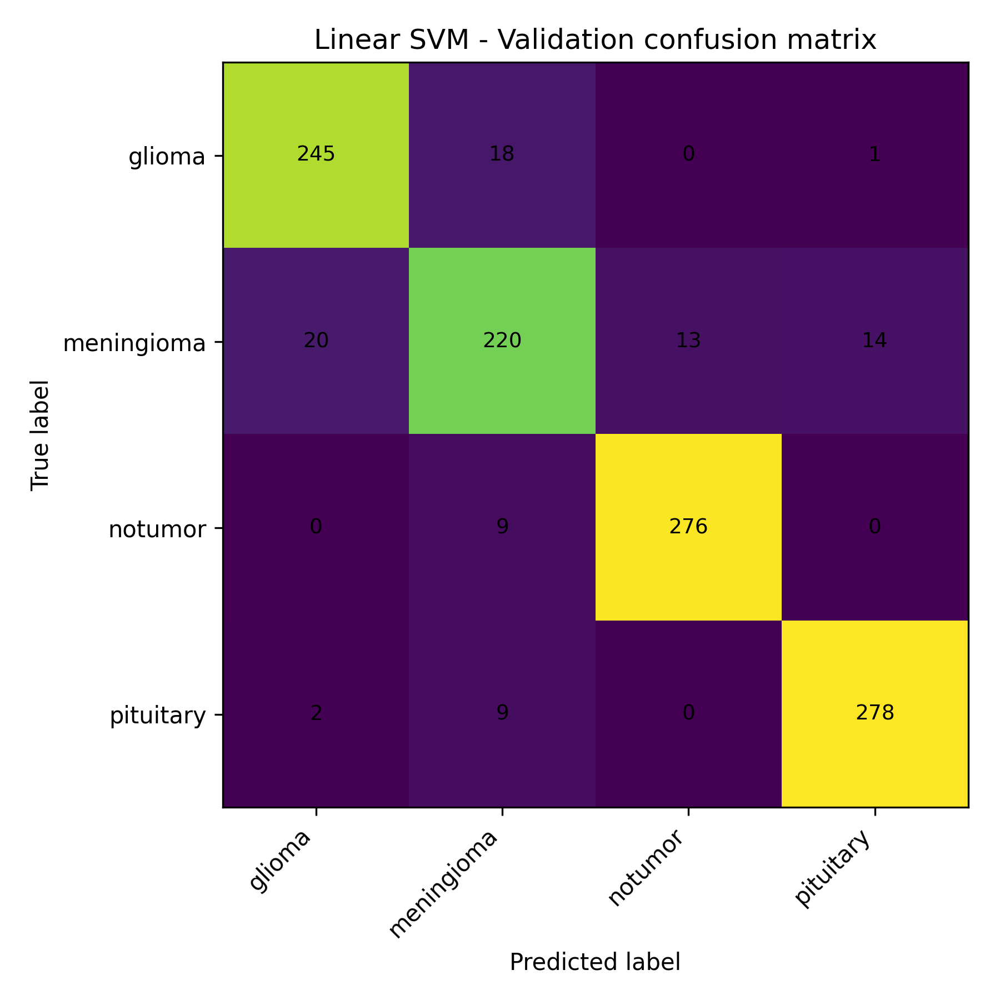
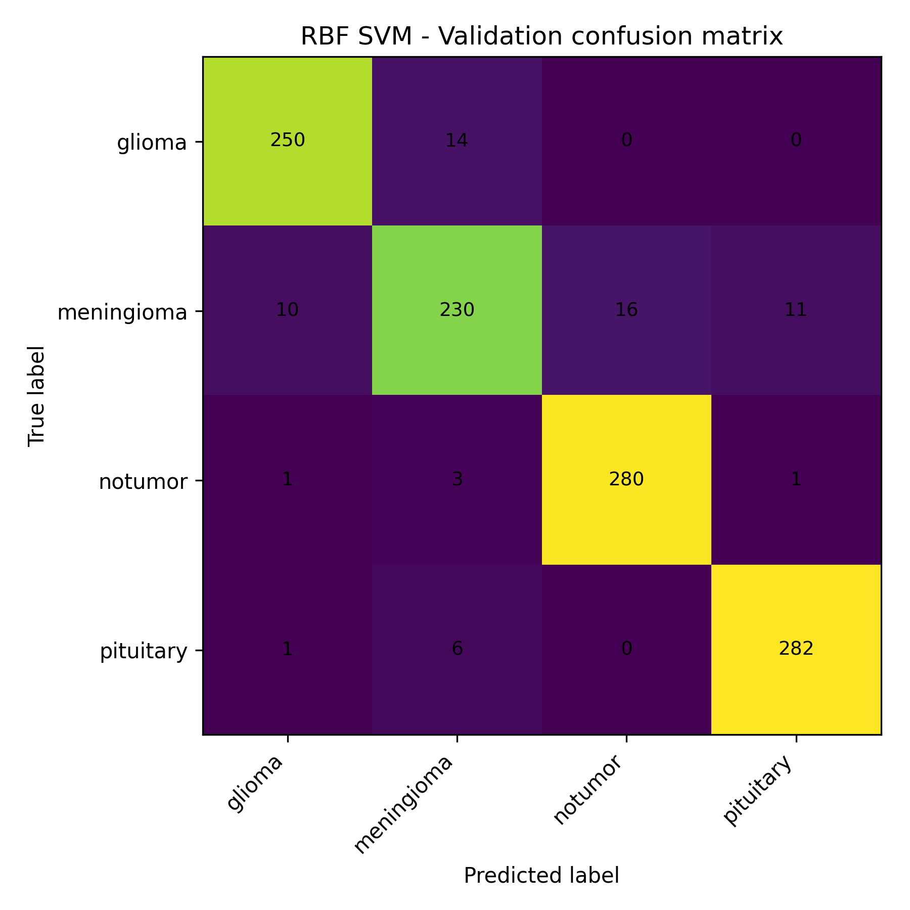
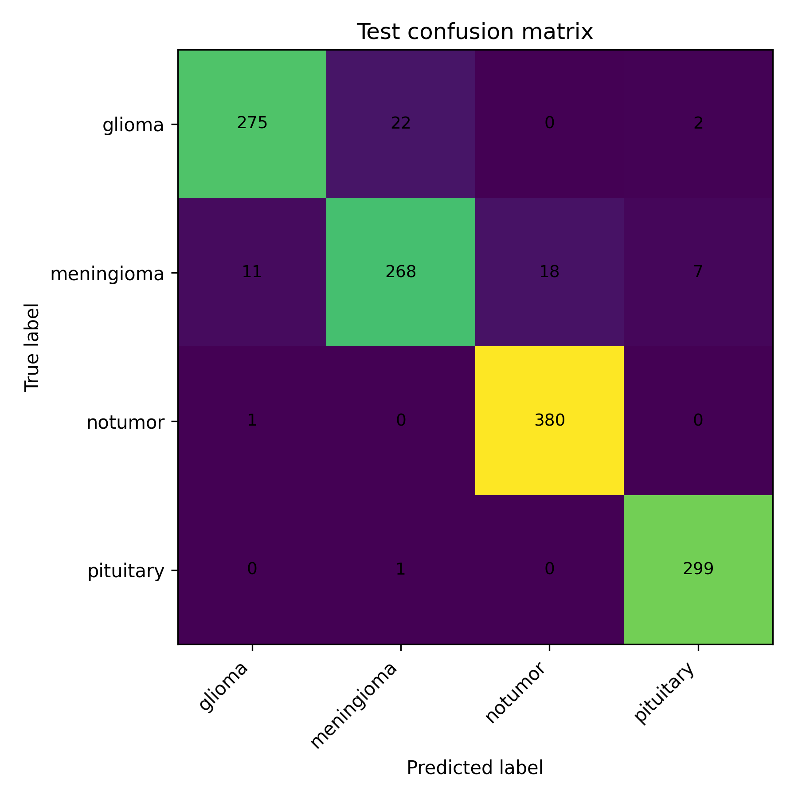
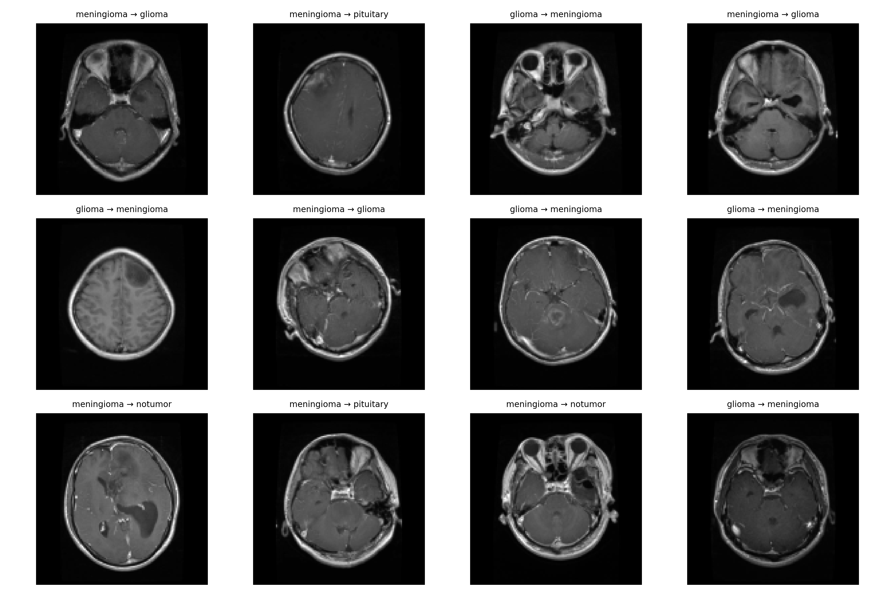

# Brain Tumor MRI Classification - Scikit-learn Baseline

*A guided baseline for processing, classifying, and evaluating MRI images with classical machine learning.*

<p align="center">
  <a href="https://github.com/John-JonSteyn/BrainTumorMRIScikitLearnClassification/stargazers" target="_blank" rel="noopener noreferrer">
    
  </a>
  <a href="https://github.com/John-JonSteyn/BrainTumorMRIScikitLearnClassification" target="_blank" rel="noopener noreferrer">
    
  </a>
  <a href="https://github.com/John-JonSteyn/BrainTumorMRIScikitLearnClassification/commits/main" target="_blank" rel="noopener noreferrer">
    
  </a>
  <a href="https://github.com/John-JonSteyn/BrainTumorMRIScikitLearnClassification/blob/main/LICENSE" target="_blank" rel="noopener noreferrer">
    
  </a>
</p>  

---

## Overview

This repository is a **walk-through notebook** that shows how to build a classical machine learning baseline for brain tumor MRI classification.  
The dataset is the [Brain Tumor MRI Dataset (CC0)](https://www.kaggle.com/datasets/masoudnickparvar/brain-tumor-mri-dataset), which contains four categories:

- **Glioma** - tumours that arise from glial cells, which support and protect neurons.  
- **Meningioma** - tumours that form in the membranes (meninges) surrounding the brain and spinal cord.  
- **Pituitary** - tumours located in the pituitary gland, a small but crucial hormone-regulating structure.  
- **No Tumor** - scans that show no visible tumour, serving as the healthy comparison group.  

The notebook documents the full process step by step:

* Loading the dataset from disk (or Kaggle API if configured)  
* Preprocessing MRI images (resize, grayscale, normalize)  
* Extracting **Histogram of Oriented Gradients (HOG)** features  
* Splitting data into train, validation, and test sets  
* Training **Support Vector Machines (SVM)** with linear and RBF kernels  
* Evaluating results with accuracy, F1, precision, recall, and confusion matrices  
* Analysing errors and discussing ethical considerations  

This is not a clinical tool. It is a **teaching example** showing how to move from raw medical images to reproducible classical ML results.

## Results

The chosen model (RBF SVM) achieved:

- **Test Accuracy:** 95.2%  
- **Macro F1 Score:** 94.9%  
- **Micro F1 Score:** 95.2%  

Most misclassifications occurred between tumour subtypes (e.g., glioma vs meningioma). Very few cases involved tumours being mistaken for “no tumour” or vice versa. This indicates the model is more reliable at detecting tumour presence, with errors mainly reflecting the difficulty of distinguishing between similar tumour types.

Figures generated in the notebook are saved under `reports/figures/`:

### PCA explained variance
<p align="center">
  
</p>

### Validation confusion matrices
<p align="center">
  
  
</p>

### Final test confusion matrix
<p align="center">
  
</p>

### Misclassified examples
<p align="center">
  
</p>

## How to Use

Clone the repository and set up a Python environment:

```bash
git clone https://github.com/John-JonSteyn/BrainTumorMRIScikitLearnClassification.git
cd BrainTumorMRIScikitLearnClassification

python -m venv venv
venv\Scripts\activate      # Windows
source venv/bin/activate   # macOS/Linux

python -m pip install -r requirements.txt
````

Then open the notebook:

```bash
jupyter notebook notebooks/brain_tumor_baseline.ipynb
```

The notebook is fully annotated — you can run it line by line to see how preprocessing, feature extraction, training, and evaluation are performed.
